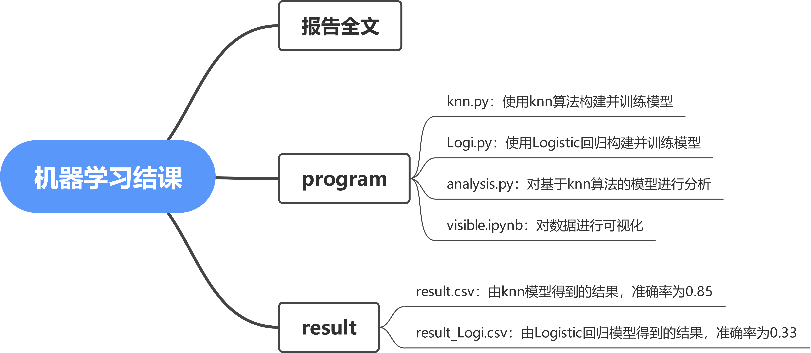

## README

本项目是华中科技大学计算机科学与技术学院2024年春《机器学习》课程结课作业。项目基于[Kaggle挑战Multi-Class Prediction of Obesity Risk](https://www.kaggle.com/competitions/playground-series-s4e2)，使用knn算法准确率可达0.85。

本项目中主要包含以下内容：

- program：包含模型训练、模型分析、数据可视化代码；

- result：使用knn算法得到的结果(result.csv)、使用Logistic回归模型得到的结果(result_Logi.csv)；

- 报告全文；

- structure.png：指示文件夹结构的导图，如下图所示：

